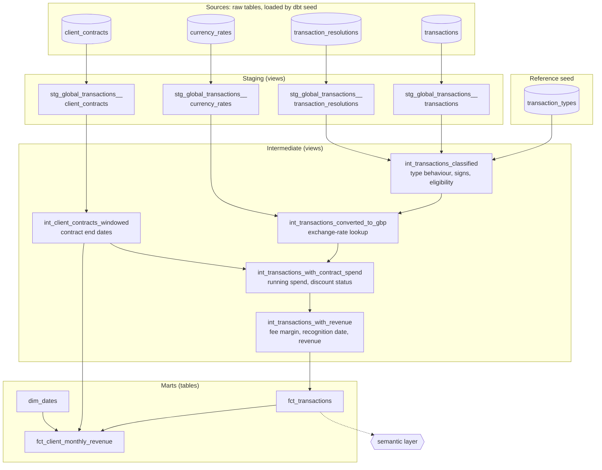

# Global Transactions

[](https://github.com/andrewharrisonway/prolific-ae-assessment/actions/workflows/dbt_ci.yml)

A dbt project that models transaction data for a global marketplace: staging and cleaning the raw sources, converting all amounts to GBP, applying contracted platform fee discounts, and producing monthly revenue recognition by client.

The original brief is in [task_instructions.md](task_instructions.md).

## Summary for reviewers

**What's here:** monthly revenue recognition by client, in GBP, with contract spend tracking and discount status. Raw data flows through staging, then one intermediate model per business step, into two facts. Start with **`fct_client_monthly_revenue`**; the [lineage](#lineage) and the [dbt docs site](https://andrewharrisonway.github.io/prolific-ae-assessment/) show how it is built.

**Key decisions**

| Decision | Alternative considered | Why |
|---|---|---|
| Recognise chargebacks in the month they resolve, and also report each transaction's original month | Transaction month only | The brief recognises only resolved chargebacks; this way past months don't move as chargebacks resolve |
| Treat a resolved chargeback as a reversal of revenue, GMV and contract spend | Treat it as positive revenue | A chargeback returns money to the cardholder, so like a refund it reduces revenue. The data has no outcome field, and no chargeback links to a payment, so this is an open question (see [Questions for stakeholders](#questions-for-stakeholders)) |
| Apply the discount from the transaction that crosses the threshold, for the rest of the term | Back-date it to the start of the term | The most direct reading of the brief; also an open question |
| Reverse a refund at its payment's margin but the refund date's exchange rate | The margin in effect on the refund date; the payment's exchange rate | The same margin applies both ways, so a full refund leaves no revenue behind except from exchange-rate movement; the client gets back the full amount in their own currency |
| Flag duplicate refunds and exclude them from revenue and spend | Keep every refund as recorded | Every refund is for the full payment amount, so a second refund of the same payment cannot be genuine |
| Load raw data with `dbt seed` but read it only through `source()` | Read the seeds with `ref()` | Keeps the models production-shaped: a real loader could replace the seeds with no model changes |
| Rebuild every model in full on each run, with no source freshness checks | Incremental models; freshness thresholds on the sources | No source has a load timestamp or updated-at column to act as a watermark, so neither can be configured safely. See [Production considerations](#production-considerations) |

**Key findings:** no contracted client reaches its discount threshold in the data provided; 7 duplicate refunds (£35,033 of revenue) are excluded; the source has no client or currency reference data; July 2024 is a partial month. See [Known findings](#known-findings).

**How it's verified:** CI builds the project from a clean checkout and runs every test on each push (badge above). 128 data tests check every model, and 8 unit tests cover logic the real data never exercises (the discount, contract windows, refund margins, exchange-rate gaps, chargebacks moving between months and reversing contract spend). A reconciliation test checks the monthly mart against the transaction fact.

## Getting started

### Prerequisites

- Python 3.11

### Setup

```bash
uv venv dbt-env --python 3.11
source dbt-env/bin/activate
uv pip install -r requirements.txt
dbt deps
```

`profiles.yml` is included in the project root, so no changes to `~/.dbt` are needed.

### Running

```bash
dbt seed
dbt build
```

Everything is written to a SQLite database at `target/global_transactions.db`, which is created on the first run. The database is disposable: `dbt clean` deletes it (along with installed packages), and `dbt deps` followed by `dbt seed` rebuilds it.

Run `dbt seed` before `dbt build`. Models read the raw tables through `source()`, which creates no dependency on the seeds in dbt's graph, so on a fresh database `dbt build` alone runs the staging models before the raw tables exist, and they fail.

### Documentation site

The docs site has an overview page, the lineage graph, and descriptions of every model, column and test. It is published at **https://andrewharrisonway.github.io/prolific-ae-assessment/**, rebuilt by CI on every push to `main`.

To build and browse it locally instead:

```bash
dbt docs generate
dbt docs serve
```

### Continuous integration

[`.github/workflows/dbt_ci.yml`](.github/workflows/dbt_ci.yml) runs on every push to `main` and every pull request: it follows the setup steps above on a clean machine, then runs `dbt seed`, `dbt build` (every model and test) and `sqlfluff lint` (models, tests and analyses). It can also be run manually from the Actions tab. Runs on `main` (pushes and manual runs) then generate the docs site and publish it to GitHub Pages.

### Why the raw data is loaded as seeds

The brief supplies the raw data as dbt seeds. Seeds are intended for small, static reference data, and in production raw data would arrive through an extract-and-load tool rather than dbt. To keep the models production-shaped:

- `seeds/raw/` stands in for that load step: `dbt seed` lands the four raw tables in the warehouse, with column types pinned so they match the data as delivered.
- Models only read raw data through `source()` (declared in `models/staging/global_transactions/_global_transactions__sources.yml`), never `ref()`. Swapping the seeds for a real loader would need no model changes.
- `seeds/reference/` holds genuine seed data: the `transaction_types` business rules.

## Project structure

```
seeds/
├── raw/            the four raw data files, loaded by dbt seed (stand-in for extract-and-load)
└── reference/      transaction_types.csv: business rules per transaction type (see below)
macros/
└── sqlite__hash.sql   makes surrogate keys work on SQLite, which has no md5()
models/
├── docs/           shared column descriptions (dbt doc blocks) and the docs site overview page
├── staging/
│   └── global_transactions/   one folder per source system: the source definition
│                              (_global_transactions__sources.yml), one staging model
│                              per raw table, and their tests (_global_transactions__models.yml)
├── intermediate/   one model per step, named int_<entity>_<verb>:
│                   int_client_contracts_windowed: contract end dates
│                   int_transactions_classified: type behaviour, signed amounts, eligibility
│                   int_transactions_converted_to_gbp: exchange-rate lookup
│                   int_transactions_with_contract_spend: contract spend and discount status
│                   int_transactions_with_revenue: fee margin, recognition date, revenue
└── marts/          dim_dates, fct_transactions, fct_client_monthly_revenue, semantic layer
tests/              singular tests (daily exchange rates, monthly mart reconciliation) and their descriptions
analyses/           naive_threshold_comparison: the naive spend measure, for comparison only (compiled, never built)
```

| Layer | Materialisation | Purpose |
|---|---|---|
| staging | view | Clean and type each source table; most data quality testing lives here |
| intermediate | view | Transaction-grain business logic |
| marts | table | Reporting outputs: facts (`fct_`) and dimensions (`dim_`) |

### Lineage



Cylinders are tables loaded by `dbt seed` (raw sources, read with `source()`, and reference data, read with `ref()`); rectangles are dbt models; the hexagon is the semantic layer, which defines metrics but builds nothing. Solid arrows are dependencies; the dotted arrow means "defined on". Tests and analyses are omitted.

## Marts

| Model | Grain | Purpose |
|---|---|---|
| `fct_client_monthly_revenue` | client × month | The deliverable: monthly revenue recognition, GMV in GBP, spend threshold tracking and discount status |
| `fct_transactions` | transaction | Transaction-level fact behind the monthly mart and the semantic layer |
| `dim_dates` | day | Fixed date spine, 2020 to 2030 (set by project vars): the month spine for the mart and the MetricFlow time spine |

`fct_transactions` deliberately passes `int_transactions_with_revenue` through unchanged. It is the stable, public interface that reports and the semantic layer depend on, so the intermediate models behind it can be split, renamed or rematerialised without breaking anything downstream. It is also materialised as a table, where the intermediate models are views, and on a production warehouse it is the model that would get an enforced contract.

**Every client appears in every month** (January to July 2024), so months without activity still show, and running totals carry forward. July is flagged `is_partial_month`: the data ends on 6 July, and the month contains only refunds and chargeback resolutions, so its recognised revenue is negative.

**Revenue is reported on two bases**, over the same recognised transactions:

- **Recognised** (`recognised_*`), the headline: revenue lands in the month it is recognised, which for chargebacks is the month they resolve. A month's figures don't change when its chargebacks later resolve (though late-arriving or corrected source data would still change them; see [Production considerations](#production-considerations)).
- **Originated** (`originated_*`): revenue lands in the month the transaction happened, counting chargebacks resolved as of the latest data, so past months are restated as chargebacks resolve.
- `pending_chargebacks_gbp` shows chargebacks still unresolved at each month end, at their recorded amount: the GMV that would be reversed if they resolve. Per client, the two bases total to the same figures; a singular test checks this against `fct_transactions`.

**GMV** is reported gross (money in: payments) and net (after refunds and resolved chargebacks). Fraud, pending chargebacks and duplicate refunds are excluded from both.

**Spend threshold tracking and discount status** are as at each month end: contract status (`no contract`, `not started`, `active`, `ended`), contract spend for the month and to date, progress towards the threshold, the date the threshold was reached, and whether the discount is active.

### Semantic layer

`models/marts/semantic_models.yml` defines MetricFlow measures and metrics on `fct_transactions`: revenue, net and gross GMV, take rate and transaction count, by recognition or transaction date, sliceable by client, type and currency. This shows how the additive measures would be defined once, so any slice can be queried without a new mart. MetricFlow cannot query SQLite, so the definitions are validated by `dbt parse` but cannot be run here. Stateful measures (contract spend against threshold, discount status, pending chargebacks at month end) are not simple aggregates, so they live in `fct_client_monthly_revenue`.

## Business logic and assumptions

### Transaction types

How each transaction type behaves is defined as data in the [`transaction_types`](seeds/reference/transaction_types.csv) seed, not in model logic:

| Type | `amount_direction` | `recognises_revenue` | `counts_toward_spend` | `requires_resolution` |
|---|---|---|---|---|
| `payment` | 1 | 1 | 1 | 0 |
| `refund` | -1 | 1 | 1 | 0 |
| `chargeback` | -1 | 1 | 1 | 1 |
| `fraud` | 1 | 0 | 0 | 0 |

- Refunds and chargebacks are negated, so they reduce revenue, GMV and contract spend. A refund reverses revenue at the margin its original payment was charged at, not the margin in effect on the refund date, so a full refund nets to zero revenue (apart from exchange-rate movement, below) even if the client's discount status changed in between.
- Fraud contributes nothing to revenue or spend.
- Chargebacks count only once resolved, and reduce revenue and spend from their resolution date. Pending chargebacks contribute zero.

The intermediate models keep both the recorded amount (`gross_amount_*`, always positive) and the signed amount (`net_amount_*`). Revenue is `net_amount_gbp × applicable_fee_margin` for recognised transactions, and 0 otherwise.

With four types, a seed is more structure than strictly needed. It is used deliberately: the business rules sit in one reviewable file, the staging model validates transaction types against it, and most of a type's behaviour (direction, revenue, spend, resolution) is data rather than logic. Rules specific to refunds, such as duplicate detection, still name the type in code; the sign tests key off `amount_direction`.

Every refund links to a payment from the same client, in the same currency, for exactly the full payment amount. Chargebacks have no linked transaction. **Assumption:** a chargeback goes directly into its `chargeback` state when the transaction is recorded, so its `transaction_date` is when that transaction was recorded. Refunds, by contrast, are placed against an earlier payment and related to it by foreign key (`linked_transaction_id`).

### Duplicate refunds

Six payments are refunded more than once (one of them three times): 7 refunds in total, worth £175,166 of GMV and £35,033 of revenue. Because every refund is for the full payment amount, a second refund of the same payment cannot be genuine, so:

- Only the first refund of each payment (by date, then transaction ID) counts.
- Later refunds are flagged `is_duplicate_refund` in staging (`stg_global_transactions__transactions`), which describes the source data without filtering it. `int_transactions_classified` then excludes flagged refunds from revenue and contract spend. The rows are kept, so the exclusion is visible and can be reported.
- A `unique` test on `linked_transaction_id` in staging catches payments refunded more than once. It accepts the 6 known payments (`warn_if` / `error_if: "> 6"`) and fails if any new duplicate appears. It also stores the failing rows (`store_failures`), so the known duplicates can be queried in the `main_dbt_test__audit` schema (`target/main_dbt_test__audit.db`).

### Currency conversion

- All amounts are converted to GBP using the latest available rate **on or before** the transaction date.
- Exchange rates end on 2024-06-30 but transactions run into July 2024, so the last available rate is carried forward.
- Chargebacks are converted at the rate on their transaction date, even when they are recognised later, in the month they resolve.
- Refunds are converted at the rate on the refund date, not the original payment's rate. The client is refunded the full amount in the currency they paid, so the GBP cost of the refund is whatever that amount is worth on the day. Any difference from exchange-rate movement between payment and refund is treated as a cost of doing business, not something to pass on to the client. In this data, USD payment and refund pairs leave a net +£1,486 of GMV (+£297 revenue) from rate movement.

### Contract discounts

- Four clients (C001–C004) have contracts; the remaining clients pay the standard platform fee margin.
- A contract is active from `contract_start_date` (inclusive) for `contract_duration_months` (end date exclusive).
- Cumulative qualifying spend in GBP is tracked within the contract window, ordered by the date each transaction takes effect (resolution date for chargebacks). Fraud and pending chargebacks do not count.
- A refund only reduces contract spend if the payment it reverses counted toward it, i.e. the payment fell inside the contract window. For example, C004's contract starts on 2024-03-01, and a refund on that day of a February payment (£64,580) does not reduce C004's spend, because the payment was never added to it.
- Chargebacks follow the same rule: a resolved chargeback only reduces contract spend if it was recorded inside the contract window (the transaction it reverses) and resolves inside it too. For example, C003's contract starts on 2024-02-01, and a chargeback recorded on 2024-01-27 and resolved on 2024-02-07 (£23,415) does not reduce C003's spend.
- Once cumulative spend reaches `spend_threshold`, the discounted fee margin applies for the remainder of the contract term. The discount applies from the transaction that crosses the threshold.
- **Assumption:** `spend_threshold` is in GBP. The contracts table does not state a currency, and each client transacts in both GBP and USD.

### Data quality fixes

- `transaction_resolutions.resolution_date` arrives as `dd/mm/yyyy`; it is converted to an ISO date in staging.
- Duplicate refunds are flagged and excluded (see above).

## Known findings

- **Duplicate refunds:** 6 payments were refunded more than once; the 7 extra refunds are excluded (see Duplicate refunds above). The test on refund links accepts these 6 and fails on any new ones.
- **No client or currency reference data.** The source supplies no client master data and no currency list. Client IDs can only be validated by format, not checked against a list of real clients, and currencies are checked against those that have exchange rates. This is treated as a data quality gap in what was supplied: a client dimension is deliberately not deduced from transaction data, because a list built from the transactions would always agree with them and so could never catch an unknown client.
- **No discount triggers during the period of observation.** No contracted client reaches its spend threshold within the data provided, so the discounted margin is never applied. The logic is implemented as I understand the business rules, rather than adjusted to make the discount trigger. Because that seemed odd, I also tried a more naive calculation: every transaction in the contract window at its gross amount, whatever its type. It does reach the threshold, for C001 and C002 in June 2024, and the comparison is kept as an analysis, [`analyses/naive_threshold_comparison.sql`](analyses/naive_threshold_comparison.sql), rather than in the mart: `dbt compile` renders it to SQL, but it is never built into a table, so nothing can report or depend on it. It works, but I don't defend it from a business standpoint: it counts fraud and refunds as spend.

## Questions for stakeholders

Questions I would raise before relying on these figures, with the assumption the project currently makes:

| Question | Assumption made | What would change |
|---|---|---|
| What does "resolved" mean for a chargeback, and in whose favour is it resolved? | Resolved means the chargeback succeeded: the money goes back to the cardholder, reversing revenue, GMV and contract spend in the resolution month | If resolved in the client's favour, the money is kept and a resolved chargeback would not reduce revenue |
| No chargeback matches a payment by client and amount, and none links to one. Where is the original transaction? | Each chargeback goes directly into its `chargeback` state when the transaction is recorded, and reverses money received | If the chargeback row is the only record of that money, a resolved chargeback should net to zero rather than reduce revenue |
| Which currency is `spend_threshold` in? | GBP | In USD, thresholds would be lower in GBP terms, bringing clients closer to their discounts |
| Once a client reaches its threshold, does the discount apply from then on, or back-dated to the start of the term? Can contracts have tiers? | From the transaction that crosses the threshold, for the rest of the term; one tier | Back-dating would require recalculating earlier months' revenue when the threshold is reached |
| Can a client have more than one contract, e.g. on renewal? | One contract per client (tested) | Contract windows would need a contract key, not just the client |
| Are fraud rows the fraudulent payments themselves? Should they count in GMV? | Fraud counts toward neither GMV, revenue nor spend | Gross GMV would include attempted fraud |
| Are fees charged per transaction or invoiced monthly? | GBP amounts are rounded to pence per transaction; revenue is left unrounded | Revenue would be rounded to pence per transaction, or per client-month invoice, to match billing |
| 16 of the 17 pending chargebacks are older than the longest resolution time seen (15 days); the oldest is 167 days. Together they are worth £810,270. Is the status feed current? | They are genuinely pending | If they have resolved, revenue and pending exposure are both misstated |
| The USD rate is exactly 0.77 on 75 of 182 days and never lower. Is that a floor in the rate source? | Rates are used as given | USD conversions on those days may be wrong |

## Production considerations

What I would change before running this on production data:

- **Freshness and incremental loading.** None of the sources has a watermark: there is no load timestamp, no updated-at column, and dates have no time. That rules out both features today:
  - **Freshness:** there is no `loaded_at_field` to check.
  - **Incremental models:** `transaction_date` is a business date, not a load time. A transaction loaded late for an earlier date would be skipped by a filter like `transaction_date > MAX(transaction_date)`.
  - **Resolutions:** `transaction_resolutions` is updated in place (pending becomes resolved) with nothing recording when a row changed, so only a `check`-strategy snapshot could track it.

  At 600 transactions the full build takes about 2.5 seconds, so a full rebuild is the right choice here. With a real loader, I would ask for a load timestamp on every table. Then I would configure source freshness and make `fct_transactions` incremental on that timestamp, with a lookback window for late data. Running contract spend is a window over each contract's whole history, so `int_transactions_with_contract_spend` would recalculate only the contracts with new activity, or persist running totals. The five chained intermediate views would become tables or incremental models; dbt_project_evaluator flags chains of views longer than 4.
- **Late-arriving and changing data.** The recognised basis is stable as chargebacks resolve, but a late-arriving transaction, a corrected exchange rate or a changed resolution status would still restate a closed month. I would snapshot the resolutions and contracts tables (dbt snapshots) and agree with finance when a month is closed.
- **Money types and rounding.** SQLite stores these amounts as floating point, which is why the reconciliation test needs a small tolerance. A production warehouse would use exact `NUMERIC` types, with a rounding policy agreed with finance (see the questions above).
- **Transaction ordering.** Same-day transactions are ordered by `transaction_id`, but IDs are allocated in blocks by type, not in time order. Real timestamps would make the threshold-crossing transaction unambiguous.
- **Data quality monitoring.** The duplicate-refund test accepts the 6 known cases; in production I would alert on new cases and fix them at source.
- **Reference data.** A client master list would allow `relationships` tests on `client_id` and a client dimension.
- **Semantic layer and contracts.** On a warehouse MetricFlow supports, the metrics would be queried and tested; the marts would get enforced model contracts, which SQLite cannot enforce.

## Testing

Generic tests are defined under `data_tests:` in each folder's `_<directory>__models.yml` file, singular tests are described in `tests/_singular_tests.yml`, and all run with `dbt build` or `dbt test`. Coverage includes:

- Uniqueness, not-null and ID format checks
- Relationships between transactions, refunds, resolutions and currencies
- Conditional rules, e.g. only refunds have a linked transaction, and only resolved chargebacks have a resolution date
- Hard and soft (warning) ranges on fee margins and exchange rates
- Unit tests (`unit_tests.yml` in `intermediate/` and `marts/`) on small hand-built fixtures, each against the model that owns the logic, for cases the real data never exercises: the discount being earned and ending with the contract, refunds of pre-contract payments, refunds reversing at their payment's margin, chargebacks reducing spend only inside the contract window, the discounted margin applying only once earned, exchange-rate gaps, chargebacks moving between months, and contract and discount status by month
- Singular tests in `tests/`: exchange rates are daily with no gaps, and the monthly mart reconciles to `fct_transactions`

SQL style is enforced with SQLFluff (`.sqlfluff`):

```bash
sqlfluff lint models tests analyses
```

## How AI was used

I built this project with Claude Code as a pair programmer. The skill in [`.claude/skills/global-transactions-dbt/`](.claude/skills/global-transactions-dbt/SKILL.md) is the brief I gave it: my SQL style, naming, layering and testing conventions, so its output followed the project's standards.

- **What I decided:** the business interpretations and data quality calls (for example, flagging and excluding duplicate refunds, not inferring a client dimension from the transactions, and accepting the exchange-rate effect on refunds), the conventions in the skill, and the scope of what to build.
- **What the AI did:** drafted and refactored models, tests and documentation to those conventions, profiled the raw data for anomalies, and reviewed the project against dbt best practice.
- **How I checked its output:**
  - Every refactor was compared, row for row, against a snapshot of each model's output taken before the change.
  - The unit tests were mutation-tested: the logic under test was deliberately broken to confirm each test fails.
  - The project was built from a fresh clone, as CI does, before pushing, and CI runs on every push.
  - I reviewed every change before committing it, and overrode suggestions that were wrong or over-engineered: for example, a custom duplicate-refund test was replaced with a built-in `unique` test, and a dbt_utils macro that breaks on SQLite was replaced with a plain SQL date spine.

## Status

- [x] Staging models and tests
- [x] Intermediate transaction model
- [x] Recognise chargebacks in the month of resolution
- [x] Monthly revenue mart: revenue by client and month, GMV in GBP, spend threshold tracking, discount status
- [x] Tests on the intermediate and mart layers
- [x] Semantic layer definitions
